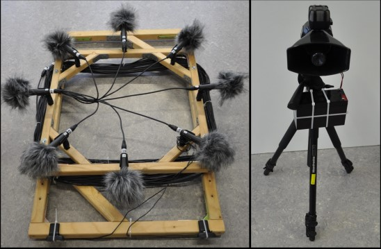

#### [1]Furletov Y, Willert V, Adamy J. Auditory scene understanding for autonomous driving[C]//2021 IEEE Intelligent Vehicles Symposium (IV). IEEE, 2021: 697-702.

A necessary condition for autonomous driving is accurate and reliable perception of the vehicle's surroundings. Current architectures rely on cameras and LIDAR to capture the visual environment and to locate and track other traffic participants. This paper, however, is inspired by the proposal of auditory perception. The article focuses on recognizing the siren sound of emergency vehicles and based on the recognition results in order to determine the correct driving strategy or plan a more rational path. The advantages of an auditory sensor are: 1 it increases the accuracy and richness of the environmental representation when other sensors are working; 2 if all other sensors are not working, it still maintains some perceptual ability to interact with the environment.

**Note 1:** 
Sound localization and classification includes information that is not available to other sensors in self-driving cars. Some extended ideas, such as sensing the sound of an engine running during ramp operations (loud enough and characteristic) can determine the type of aircraft or plan the appropriate route of operation based on whether the engine starts or not (considering the engine danger zone). It is also possible to sense sounds from tires to determine vehicle traction control, or speed information.

**Note 2:**
Different sound processing algorithms are able to detect and classify different objects, extract auditory cues specific to particular types of objects, and localize each object through a combination of arrival time delays and amplitude based localization algorithms, mainly calculated by extracting the absolute loudness levels of microphones or the interaural time and level differences between several microphones, which can also be a complement to recognition detection.

