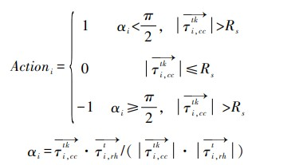

#### [1]Zeng Tuocheng,Wang Jiajun,Wang Xiaoling et al. Research on improved multi-objective multi-visual unloading recognition model for dam transporters under large scene video monitoring[J/OL]. Journal of Water Resources:1-12[2023-05-05]. https://doi.org/10.13243/j.cnki.slxb.20220910.

The paper features an application scenario for object detection under large range and large scale. It addresses the disadvantages of high equipment cost and low recognition accuracy of the current vehicles by using GNSS only for vehicle motion state analysis, and solves this problem through vision technology. It adopts bytetrack to realize the object detection and tracking of multiple transport vehicles in large-scene surveillance video, record their driving trajectory, and combine with HRNet, a key point detection network.

**Note 1:** 
Bytetrack is originally an algorithm used for pedestrian re-identification, and the authors migrate it to vehicles to achieve real-time tracking and recording of driving trajectories of multiple targets of transport vehicles in surveillance videos, for also providing more accurate driving speed, which is worth learning from.

**Note 2:**
The most worthwhile point to learn in this paper is by combining bytetrack and HRNet, i.e., combining the results of driving trajectory and key point detection to determine the forward, stop and backward travel states of the transport vehicle, as follows:

Where 1 means backward, 0 means stop, -1 means forward. ai indicates the angle between the direction of travel of the ith transport vehicle and the direction of that transport vehicle from the key point at the front to the key point at the rear (when one of the key points at the front or rear is lacking, the transport vehicle is assumed as a rigid body and the center point of the tracking frame is used instead).

**Note 3:**
For large-scene video surveillance 1080p image resolution and the calculation speed of multiple visual recognition algorithms, 960*544 image size is used as the network input and 3 scales of decoupling heads are set at the network output to output anchor frame information, which can guarantee the accuracy and improve the efficiency at the same time.

