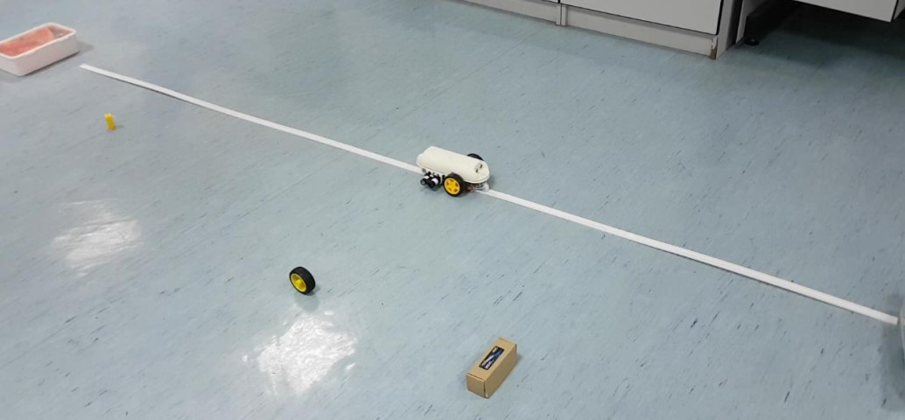

#### [1]Elrayes A, Ali M H, Zakaria A, et al. Smart airport foreign object debris detection rover using LiDAR technology[J]. Internet of Things, 2019, 5: 1-11.

This paper proposes and implements an intelligent robot solution for FOD detection at airports. The solution consists of installing millimeter wave sensors and LIDAR on the vehicle, and the vehicle moves along a designated track so as to achieve FOD ranging sensing, and when FOD is detected, a message with the FOD location is sent to the airport staff via Bluetooth or WIFI network. The system is capable of detecting FODs of various sizes at different distances from the vehicle. the vehicle is notable for its low cost and design that does not interfere with airside operations at the airport.

**Note 1:** 
The location of the FOD in the paper is identified using two coordinates: (i) the distance x0 between the vehicle and the FOD, calculated by the LiDAR sensor; and (ii) the relative position of the vehicle relative to the starting point y0 along the track, measured using an odometer. If debris is detected, the vehicle's communication system will send a message to the operator that will contain information about the object's location (x0, y0). The vehicle's obstacle avoidance is fixed to the front and rear of the vehicle by two pairs of ultrasonic sensors. If an obstacle is detected, the vehicle will stop and send a message, and then start backing up. Because of its fixed track, it cannot implement autonomous obstacle avoidance operation, so the application scenario of this vehicle is limited and cannot be laid in large quantities.

**Note 2:**
The vehicle cannot identify the type of FOD because it is not paired with a camera, so it can be considered to incorporate camera identification and combined with the study of more mature FOD detection algorithms, which may achieve better results. In addition the experiment of the article is divided into indoor laboratory and outdoor parking lot, suggesting that our subsequent experimental process can also be divided into two indoor and outdoor scenarios, which is more convincing.

