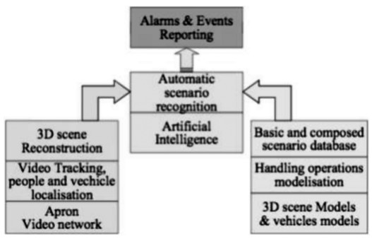

#### [1]Donadio, F., Frejaville, J., Larnier, S., & Vetault, S. (2016, October). Human-robot collaboration to perform aircraft inspection in working environment. In Proceedings of 5th International conference on Machine Control and Guidance (MCG).

The paper describes two projects. One is intelligent video surveillance for monitoring ramp operations. The second is a collaborative mobile robot. For intelligent surveillance, the project uses data fusion methods to further process and categorize data on the basis of predefined object categories (people, vehicles, aircraft, etc.) and to associate these objects with functions in a three-dimensional form. In addition the paper describes the AIR-COBOT project for improving the efficiency of maintaining aircraft and the traceability of maintenance operations. The robot is capable of tracking, identifying and avoiding obstacles, and its main task is to analyze images of the aircraft after they have been acquired, to determine if the cabin doors are open or closed; if there are protections for certain equipment (static ports, probes); the state of the turbine fan blades; the state of the probes; or the wear and tear of the landing gear tires.

**Note 1:**  

The paper's motion understanding algorithm is worthwhile. It does this by prior modeling and then compares real-time data against it using a form of "knowledge base". The basic idea is to first automatically report the ramp area information matching the relevant scene to the corresponding operator, then to fuse all the information related to the scene in the data fusion module, and finally to recognize the events occurring within the video stream information. The spatial and temporal characteristics of the detected moving objects are modeled by spatial and temporal relationships graded by different intensities. The system consists of three modules: trajectory velocity analysis module, trajectory clustering module and activity analysis module. The first module segments trajectories into segments of comparable velocity. The second module obtains the behavioral displacement patterns of the origin and destination of the moving objects observed in the scene by clustering the moving trajectories and discovering the topology of the scene.

**Note 2:**

The robot is navigated by first telling the robot the trajectory by the operator moving the robot in remote control mode or follow mode, and thereafter automatically following the trajectory, which relies heavily on GPS data to access the ramp. The robot is able to localize itself by laser data or image data from a camera, and for aircraft detection it mainly obtains a 3D point cloud by LiDAR, and matches between the aircraft model and the field point cloud to estimate the static attitude of the aircraft and the robot.

